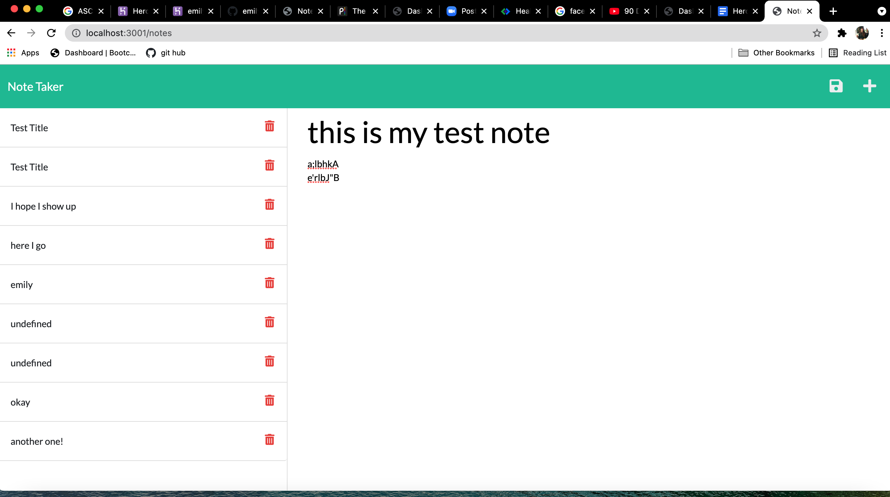

# Note Taker App

## Description
This app allows you to add and modify notes in a note taking app. The page automatically displays previous notes. When a new note is written the save button appears. When clicked the new note moves over to the previous column and allows you to add a new note. When a note from the saved notes file is click on, it pulls up said note in the right side note editor/maker.

## Usage
For users to create notes such as reminders, grocery lists ect.

## Screenshot 

## deployed links

https://github.com/emilyelizabethdaniel/noteTaker

https://emilydaniel-notetaker.herokuapp.com/